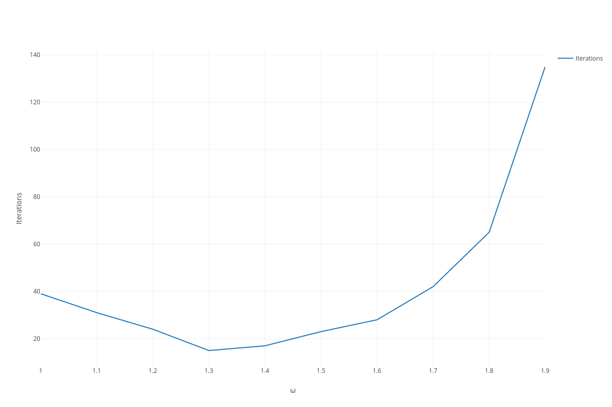

---
header-includes:
  - \usepackage{listings}
---

# ECSE 543 Numerical Methods - Assignment 1

Anass Al-Wohoush, 260575013

## Preface
All questions use my two-dimensional matrix library in `matrix.py`. This can be
found in the Appendix. Moreover, all code was written for Python 3 and is not
Python 2 compatible.

## Question 1

### a
See `cholesky.py` in the Appendix for the implementation.

### b
A small function `random_symmetric_positive_definite_matrix(n)` was written to
generate a random, square, symmetric positive-definite matrix of size
$N \times N$.

This was achieved by first generating a random $N \times N$ matrix $L$ and then
computing:

$$
A = LL^T
$$

This yields a square, symmetric, positive-definite matrix $A$ as long as the
diagonal is positive. In this case, the random number generator used always
outputs numbers between 0 and 1.

### c
The output of running `cholesky.py` is as follows:

```
$ python3 cholesky.py
N = 2
A =
|   0.608   0.617 |
|   0.617   0.656 |
b =
|   0.429 |
|   0.444 |
x =
|   0.422 |
|   0.280 |
correct

N = 3
A =
|   1.446   1.195   1.124 |
|   1.195   1.088   0.897 |
|   1.124   0.897   1.064 |
b =
|   2.331 |
|   1.998 |
|   1.922 |
x =
|   0.239 |
|   0.960 |
|   0.745 |
correct

N = 4
A =
|   0.472   0.463   0.580   0.322 |
|   0.463   1.258   1.049   0.944 |
|   0.580   1.049   1.322   0.629 |
|   0.322   0.944   0.629   0.812 |
b =
|   1.017 |
|   2.126 |
|   2.015 |
|   1.571 |
x =
|   0.419 |
|   0.286 |
|   0.681 |
|   0.907 |
correct

N = 5
A =
|   1.832   0.677   1.320   0.740   1.321 |
|   0.677   1.088   1.075   0.510   0.922 |
|   1.320   1.075   1.886   0.961   1.354 |
|   0.740   0.510   0.961   0.548   0.607 |
|   1.321   0.922   1.354   0.607   1.569 |
b =
|   2.182 |
|   1.817 |
|   2.461 |
|   1.237 |
|   2.234 |
x =
|   0.405 |
|   0.847 |
|   0.118 |
|   0.316 |
|   0.361 |
correct
```

### d
See `linear_resistive_network.py` in the Appendix for the implementation
and `circuit_[1-5].circ` for sample circuit files.

Each circuit file is organized as follows:

```
n <number of nodes>
m <number of branches>
<branch 1>
<branch 2>
...
<branch m>
```

where each branch is represented as follows:

```
<start node id> <end node id> <current source in A> <resistance in Ohms> <voltage in V>
```

and node IDs are within the range of $[0, n - 1]$.
If a branch is missing one of the components, simply put a $0$.
It is assumed that the $0$-th node is ground.

*Note: You need to make sure of your circuit's polarity.*

The code then constructs proper $J_k$, $R_k$, $E_k$, $Y$ and $A$ matrices and
computes the voltage at all the nodes.

The sample circuits provided are the same as the ones provided by the TAs on
MyCourses, and the following is the output of running
`linear_resistive_network.py` on all of them:

```
$ python3 linear_resistive_network.py circuits/*.circ
circuits/circuit_1.circ
node count: 2
branch count: 2
voltages [5.0]

circuits/circuit_2.circ
node count: 2
branch count: 3
voltages [50.00000000000001]

circuits/circuit_3.circ
node count: 2
branch count: 3
voltages [55.00000000000001]

circuits/circuit_4.circ
node count: 3
branch count: 5
voltages [19.999999999999993, 34.999999999999986]

circuits/circuit_5.circ
node count: 4
branch count: 6
voltages [5.000000000000001, 3.7500000000000004, 3.750000000000001]
```

The results check out with the ones provided by the TAs.

\newpage
## Question 2

### a
See `resistor_mesh.py` in the Appendix for the implementation.
See **c** for output.

### b
Theoretically, the Cholesky implementation in use should grow as
$O(n^2) = O((3N)^2) = O(9N^2)$. This seems to match the data points in Figure 1
where the unbanded curve fits the following quadratic equation:

$$
Time(N) = 11.37069 - 6.30284N + 0.7654233N^2
$$

**Note**: _This is wrong. This should grow as $O(N^6)$ when taking all the
operations into account._

### c
Both a `SparseMatrix2D` class and a Cholesky decomposition implementation with
a half-bandwidth parameter were implemented for this.

The output of `resistor_mesh.py` is as follows, and shows the time taken with
and without banding in seconds.

```
$ python3 resistor_mesh.py
N 2
Banded True
time 0.0030488967895507812
Banded False
time 0.003353118896484375
R_eq 1874.9999999999989

N 3
Banded True
time 0.023561954498291016
Banded False
time 0.027592897415161133
R_eq 2379.545454545455

N 4
Banded True
time 0.10523390769958496
Banded False
time 0.13087677955627441
R_eq 2741.0254050073618

N 5
Banded True
time 0.36984920501708984
Banded False
time 0.47939205169677734
R_eq 3022.8192517522425

N 6
Banded True
time 1.0337557792663574
Banded False
time 1.4354090690612793
R_eq 3253.6756586206884

N 7
Banded True
time 2.634708881378174
Banded False
time 3.201604127883911
R_eq 3449.1662985195208

N 8
Banded True
time 5.542253017425537
Banded False
time 8.740787982940674
R_eq 3618.674867141452

N 9
Banded True
time 10.992770195007324
Banded False
time 14.456946849822998
R_eq 3768.290873310036

N 10
Banded True
time 21.286498069763184
Banded False
time 27.429426193237305
R_eq 3902.189138653053
```

The half-bandwidth of an $N\times2N$ resistor mesh turns out to be $b = N + 1$.

We can see that with banding, the algorithm outperforms the original by quite a
factor. Figure 1 depicts the trend.


The theoretical computation time should grow as
$O(b^2 n) = O(3N (N + 1) \approx O(3N^2)$, and the data somewhat agrees with
that as it can be fit with the following quadratic curve:

$$
Time(N) = 9.207683 - 5.038196 N + 0.6020445 N^2
$$

We see that this curve has a smaller slope than the unbanded fit in **b** as
expected, although that we do not see the expected 3 times performance gain.
This is likely due to implementation detail and overhead.

**Note**: _As in **b**, this is wrong. This should grow as $O(N^6)$ when taking
all the operations into account._

# d
Figure depicts 2 the trend of the total resistance $R$ of a
$N\times2N$ resistor mesh as $N$ increases.


An exponential fit of the data yields:

$$
R(N) = 667.2207 + \frac{748.8233}{0.2024204}(1 - e^{-0.2024204 N})
$$

the limit as $N\to\infty$ of which is $4366.57 \Omega$.

\newpage
## Question 3

### a
See `finite_differences.py` and `rectangle.py` in the Appendix for the
implementation.

### b
The output of `finite_differences.py` while varying $\omega$ in the SOR
algorithm is as follows:

```
$ python3 finite_differences.py
SOR
varying w...
w = 1.0
h = 0.02
voltage at (0.06, 0.04) = 5.526328463163292 V
iterations 39
|   0.000   0.000   0.000   0.000   0.000   0.000 |
|   0.000   0.957   1.862   2.606   3.036   3.171 |
|   0.000   1.967   3.883   5.526   6.367   6.613 |
|   0.000   3.026   6.179   9.249  10.291  10.549 |
|   0.000   3.959   8.557  15.000  15.000  15.000 |
|   0.000   4.252   9.092  15.000  15.000  15.000 |

w = 1.1
h = 0.02
voltage at (0.06, 0.04) = 5.52633057452387 V
iterations 31
|   0.000   0.000   0.000   0.000   0.000   0.000 |
|   0.000   0.957   1.862   2.606   3.036   3.171 |
|   0.000   1.967   3.883   5.526   6.367   6.613 |
|   0.000   3.026   6.179   9.249  10.291  10.549 |
|   0.000   3.959   8.557  15.000  15.000  15.000 |
|   0.000   4.252   9.092  15.000  15.000  15.000 |

w = 1.2
h = 0.02
voltage at (0.06, 0.04) = 5.526334622325284 V
iterations 24
|   0.000   0.000   0.000   0.000   0.000   0.000 |
|   0.000   0.957   1.862   2.606   3.036   3.171 |
|   0.000   1.967   3.883   5.526   6.367   6.613 |
|   0.000   3.026   6.179   9.249  10.291  10.549 |
|   0.000   3.959   8.557  15.000  15.000  15.000 |
|   0.000   4.252   9.092  15.000  15.000  15.000 |

w = 1.3
h = 0.02
voltage at (0.06, 0.04) = 5.526339954123605 V
iterations 15
|   0.000   0.000   0.000   0.000   0.000   0.000 |
|   0.000   0.957   1.862   2.606   3.036   3.171 |
|   0.000   1.967   3.883   5.526   6.367   6.613 |
|   0.000   3.026   6.179   9.249  10.291  10.549 |
|   0.000   3.959   8.557  15.000  15.000  15.000 |
|   0.000   4.252   9.092  15.000  15.000  15.000 |

w = 1.4
h = 0.02
voltage at (0.06, 0.04) = 5.526339108320872 V
iterations 17
|   0.000   0.000   0.000   0.000   0.000   0.000 |
|   0.000   0.957   1.862   2.606   3.036   3.171 |
|   0.000   1.967   3.883   5.526   6.367   6.613 |
|   0.000   3.026   6.179   9.249  10.291  10.549 |
|   0.000   3.959   8.557  15.000  15.000  15.000 |
|   0.000   4.252   9.092  15.000  15.000  15.000 |

w = 1.5
h = 0.02
voltage at (0.06, 0.04) = 5.526341561643155 V
iterations 23
|   0.000   0.000   0.000   0.000   0.000   0.000 |
|   0.000   0.957   1.862   2.606   3.036   3.171 |
|   0.000   1.967   3.883   5.526   6.367   6.613 |
|   0.000   3.026   6.179   9.249  10.291  10.549 |
|   0.000   3.959   8.557  15.000  15.000  15.000 |
|   0.000   4.252   9.092  15.000  15.000  15.000 |

w = 1.6
h = 0.02
voltage at (0.06, 0.04) = 5.526350179309807 V
iterations 28
|   0.000   0.000   0.000   0.000   0.000   0.000 |
|   0.000   0.957   1.862   2.606   3.036   3.171 |
|   0.000   1.967   3.883   5.526   6.367   6.613 |
|   0.000   3.026   6.179   9.249  10.291  10.549 |
|   0.000   3.959   8.557  15.000  15.000  15.000 |
|   0.000   4.252   9.092  15.000  15.000  15.000 |

w = 1.7
h = 0.02
voltage at (0.06, 0.04) = 5.5263398795054925 V
iterations 42
|   0.000   0.000   0.000   0.000   0.000   0.000 |
|   0.000   0.957   1.862   2.606   3.036   3.171 |
|   0.000   1.967   3.883   5.526   6.367   6.613 |
|   0.000   3.026   6.179   9.249  10.291  10.549 |
|   0.000   3.959   8.557  15.000  15.000  15.000 |
|   0.000   4.252   9.092  15.000  15.000  15.000 |

w = 1.8
h = 0.02
voltage at (0.06, 0.04) = 5.526347044249589 V
iterations 65
|   0.000   0.000   0.000   0.000   0.000   0.000 |
|   0.000   0.957   1.862   2.606   3.036   3.171 |
|   0.000   1.967   3.883   5.526   6.367   6.613 |
|   0.000   3.026   6.179   9.249  10.291  10.549 |
|   0.000   3.959   8.557  15.000  15.000  15.000 |
|   0.000   4.252   9.092  15.000  15.000  15.000 |

w = 1.9
h = 0.02
voltage at (0.06, 0.04) = 5.526348497699973 V
iterations 135
|   0.000   0.000   0.000   0.000   0.000   0.000 |
|   0.000   0.957   1.862   2.606   3.036   3.171 |
|   0.000   1.967   3.883   5.526   6.367   6.613 |
|   0.000   3.026   6.179   9.249  10.291  10.549 |
|   0.000   3.959   8.557  15.000  15.000  15.000 |
|   0.000   4.252   9.092  15.000  15.000  15.000 |

minimum w = 1.3 @ 15 iterations
```

We see that a minimum iteration count is achieved at $\omega = 1.3$. Figure 3
and Table 1 show this more clearly.



$\omega$ iterations
-------- ----------
1.0      39
1.1      31
1.2      24
1.3      15
1.4      17
1.5      23
1.6      28
1.7      42
1.8      65
1.9      135
-------- ----------

Table: Iteration count of SOR as $\omega$ is varied

### c
The output of `finite_differences.py` while varying $h$ in the SOR algorithm is
as follows:

```
$ python3 finite_differences.py
SOR
varying h...
w = 1.3
h = 0.02
voltage at (0.06, 0.04) = 5.526339954123605 V
iterations 15

w = 1.3
h = 0.01
voltage at (0.06, 0.04) = 5.350631975646194 V
iterations 76

w = 1.3
h = 0.005
voltage at (0.06, 0.04) = 5.289101959709918 V
iterations 276

w = 1.3
h = 0.0025
voltage at (0.06, 0.04) = 5.265178388219577 V
iterations 960

w = 1.3
h = 0.00125
voltage at (0.06, 0.04) = 5.253333293492389 V
iterations 3253
```

We see that decreasing $h$ increases our accuracy and that we are converging to
a voltage of $\approx 5.253 V$. However, decreasing $h$ not only increases the
number of nodes that need to be computed, but also increases the number of
iterations required dramatically. This leads to a major increase in computation
time. The following Figure 4 and Table 2 depict this effect.


$\frac{1}{h}$ iterations
------------- ----------
50            15
100           76
200           276
400           960
800           3253
------------- ----------

Table: Iteration count of SOR as $h$ is varied

### d
The output of `finite_differences.py` while varying $h$ in the Jacobi algorithm
is as follows:

\newpage
```
$ python3 finite_differences.py
Jacobi
varying h...
h = 0.02
voltage at (0.06, 0.04) = 5.526320009881193 V
iterations 73

h = 0.01
voltage at (0.06, 0.04) = 5.35058706964602 V
iterations 272

h = 0.005
voltage at (0.06, 0.04) = 5.288930319471085 V
iterations 963

h = 0.0025
voltage at (0.06, 0.04) = 5.264444307620962 V
iterations 3309

h = 0.00125
voltage at (0.06, 0.04) = 5.250150094845374 V
iterations 11032
```

As for SOR, we see that decreasing $h$ increases our accuracy and that we are
converging to a voltage of $\approx 5.250 V$. However, decreasing $h$ not only
increases the number of nodes that need to be computed, but also increases the
number of iterations required dramatically. This leads to a major increase in
computation time. Figure 5 and Table 3 depict this effect.


$\frac{1}{h}$ iterations
------------- ----------
50            731
100           272
200           963
400           3309
800           11032
------------- ----------

Table: Iteration count of Jacobi as $h$ is varied

We see that Jacobi and SOR both converge to approximately the same output given
the same $h$. However, Jacobi is slower and requires more iterations to
converge for the same $h$.

### e
*Not attempted due to lack of time.*

\newpage
## Appendix

### `matrix.py`

\lstinputlisting[language=Python]{matrix.py}

\newpage
### `cholesky.py`

\lstinputlisting[language=Python]{cholesky.py}

\newpage
### `linear_resistive_network.py`

\lstinputlisting[language=Python]{linear_resistive_network.py}

\newpage
### `resistor_mesh.py`

\lstinputlisting[language=Python]{resistor_mesh.py}

\newpage
### `finite_differences.py`

\lstinputlisting[language=Python]{finite_differences.py}

\newpage
### `rectangle.py`

\lstinputlisting[language=Python]{rectangle.py}

\newpage
### `circuit_1.circ`

\lstinputlisting{circuits/circuit_1.circ}

### `circuit_2.circ`

\lstinputlisting{circuits/circuit_2.circ}

### `circuit_3.circ`

\lstinputlisting{circuits/circuit_3.circ}

### `circuit_4.circ`

\lstinputlisting{circuits/circuit_4.circ}

### `circuit_5.circ`

\lstinputlisting{circuits/circuit_5.circ}
