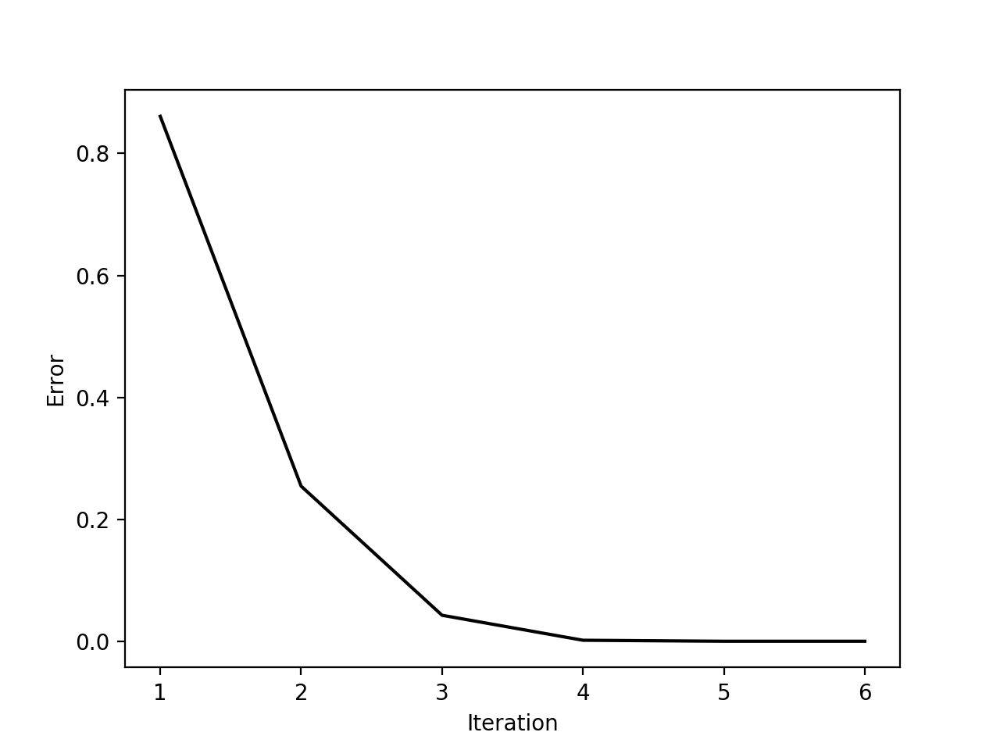
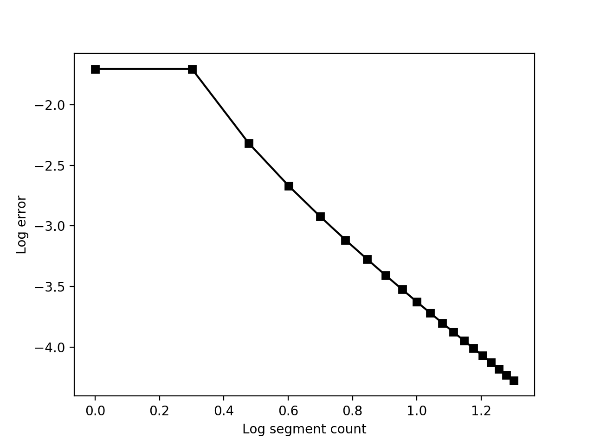
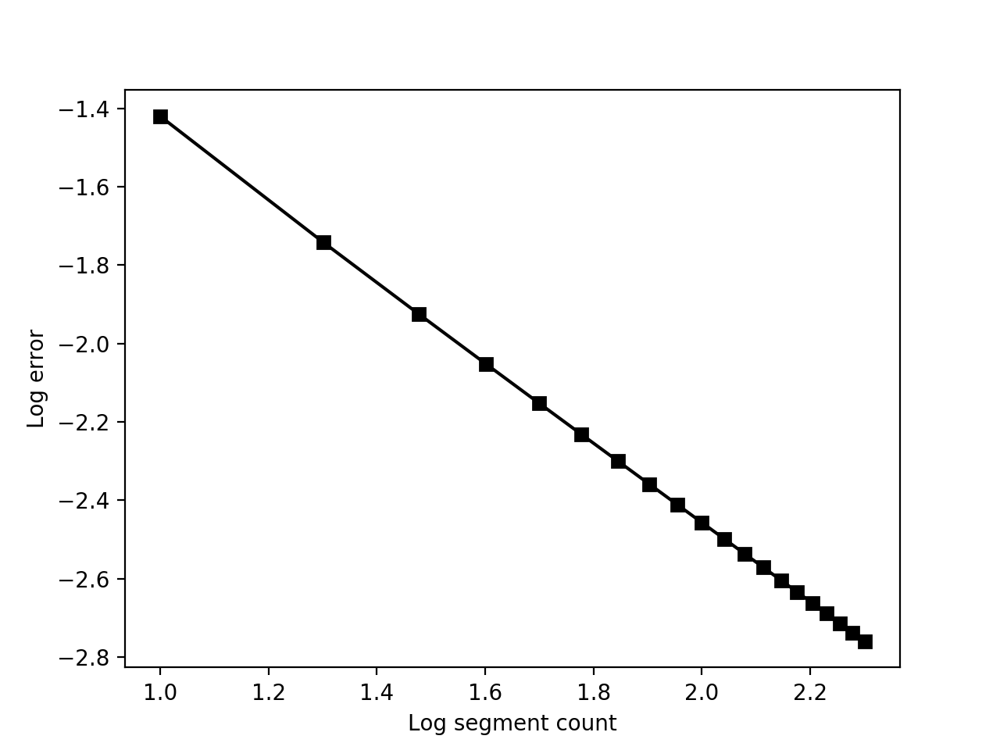

---
header-includes:
  - \usepackage{listings}
cref: true
---

\lstset{basicstyle=\small}
\crefformat{equation}{(#2#1#3)}
\crefformat{figure}{Figure~#2#1#3}
\crefformat{table}{Table~#2#1#3}

# ECSE 543 Numerical Methods - Assignment 3

Anass Al-Wohoush, 260575013

## Question 1

### a
{#fig:interp-a width=75%}

@fig:interp-a seems like a plausible B-H curve over the given range. 

### b
{#fig:interp-b width=75%}

@fig:interp-b does not seem like a plausible B-H curve over the given range. 

### c
{#fig:interp-c width=75%}

@fig:interp-c is the generated interpolation plot by setting the slopes to:

$$
\frac{y_1 - y_0}{x_1 - x_0}.
$$

## Question 2

### a
We have:

$$
\begin{aligned}
\mathcal{R}_{a} &= \frac{L_a}{A \mu_0} = \frac{0.005}{0.0001 \times 4\pi \times 10^{-7}} = 3.9789 \times 10^7 \text{H}^{-1} \\
\mathcal{R}_{c} &= \frac{L_c}{A \mu}.
\end{aligned}
$$

$\mu$ is non-linear and can be measured from the B-H curve in Question 1 as:

$$
\begin{aligned}
\mu &= \frac{B}{H}, \\
B &= \frac{\Psi}{A}.
\end{aligned}
$$

Subsituting back, yields:

$$
\mathcal{R}_{c} = \frac{L_c H}{\Psi},
$$

where $H$ is a function of $\Psi$. The flux $\Psi$ in the core can then be expressed as follows:

$$
\begin{aligned}
f(\Psi) &= (\mathcal{R}_{a} + \mathcal{R}_{c}) \Psi - I N = 0 \\
f(\Psi) &= 3.9789 \times 10^7 \Psi + 0.30 H(\Psi) - 8000 = 0.
\end{aligned}
$$

### b

Newton-Raphson was able to solve the equation above in 3 iterations and yielded
$1.612 \times 10^-4$ Wb.

```
Newton-Raphson method
iteration: 1, x = 1.999525E-04, f(x) = +9.356309E+03
iteration: 2, x = 1.689268E-04, f(x) = +1.201902E+03
iteration: 3, x = 1.612691E-04, f(x) = +2.728484E-12
Magnetic flux = 1.612691E-04 Wb
```

### c

Successive substitution did not originally converge, but modifying the
iteration step to:

$$
x_{i+1} = x_i - c f(x_i)
$$

converged after 9 iterations to the same solution as in **b** with
$c = 6.5 \times 10^{-9}$. $c$ was determined by trial and error until it
converged.

```
Successive substitution method
iteration: 1, x = 5.200000E-05, f(x) = -5.913686E+03
iteration: 2, x = 9.043896E-05, f(x) = -4.353204E+03
iteration: 3, x = 1.187348E-04, f(x) = -3.174563E+03
iteration: 4, x = 1.393694E-04, f(x) = -2.145668E+03
iteration: 5, x = 1.533163E-04, f(x) = -9.591690E+02
iteration: 6, x = 1.595509E-04, f(x) = -2.502577E+02
iteration: 7, x = 1.611776E-04, f(x) = -1.436812E+01
iteration: 8, x = 1.612709E-04, f(x) = +2.902504E-01
iteration: 9, x = 1.612691E-04, f(x) = -5.863349E-03
Magnetic flux = 1.612691E-04 Wb
```

## Question 3

### a
We have:

$$
\begin{aligned}
A &= \begin{bmatrix}
  1 & -1 & 0 \\
  0 & 1 & -1 \\
\end{bmatrix} \\
Y &= \begin{bmatrix}
  \frac{1}{R} & 0 & 0 \\
  0 & 0 & 0 \\
  0 & 0 & 0 \\
\end{bmatrix} \\
E &= \begin{bmatrix}
  -E \\
  0 \\
  0 \\
\end{bmatrix} \\
J(v_A, v_B) &= J(\textbf{v}) = \begin{bmatrix}
  0 \\
  I_{sA} \left(e^{\frac{v_A - v_B}{v_T}} - 1\right) \\
  I_{sB} \left(e^{\frac{v_B}{v_T}} - 1\right) \\
\end{bmatrix}.
\end{aligned}
$$

Putting it together, yields the following non-linear equation:

$$
f(v_A, v_B) = f(\textbf{v}) = (AYA^T)\textbf{v} - A(J(\textbf{v}) - YE) = 0. 
$$

### b
Multi-variate Newton-Raphson was implemented with the following iteration step:

$$
\textbf{x}_{i+1} = \textbf{x}_{i} - J(\textbf{x}_{i}) f(\textbf{x}_{i}),
$$

where $J(\textbf{x})$ is the Jacobian of $f(\textbf{x})$. This was iterated
until:

$$
\left|\frac{f(\textbf{x})}{f(\textbf{0})}\right| < 10^{-6}.
$$

After 6 iterations, the algorithm converged to $v_A = 0.1981$ V and
$v_B = 0.0906$ V. @fig:newton-error shows that the convergence is indeed
quadratic.

```
iteration: 1
V = |     0.2183 |
    |     0.0728 |
error: +8.611088E-01

iteration: 2
V = |     0.2057 |
    |     0.0816 |
error: +2.543734E-01

iteration: 3
V = |     0.2001 |
    |     0.0892 |
error: +4.263844E-02

iteration: 4
V = |     0.1982 |
    |     0.0905 |
error: +1.640352E-03

iteration: 5
V = |     0.1981 |
    |     0.0906 |
error: +2.562020E-06

iteration: 6
V = |     0.1981 |
    |     0.0906 |
error: +6.326535E-12
```

{#fig:newton-error width=75%}

## Question 4

### a
{#fig:sin-x-error width=75%}

@fig:sin-x-error depicts the log error. We see that the one-point Gauss-Legendre
works really well for this function and converges with a very small $N$. This is
likely due to the fact that this function is symmetrical and doesn't vary widely
within the range.

### b
{#fig:ln-x-error width=75%}

@fig:ln-x-error depicts the log error. We see that the one-point Gauss-Legendre
does not work as well for this function. The precision $sin(x)$ achieved was not
reached even with an order of magnitude larger $N$. This is likely due to the
fact that this function is highly non-linear and only a one-point method was
used.

### c
$ln(x)$ varies more widely closer to $x = 0$ than $x = 1$. We can thus have
denser segments closer to $x = 0$. We opt for a function that is inversely
proportional to $ln(x)$ to determine the probing points. For $N$ unevenly
distributed points, the following works very well:

$$
x_{i} = \left(\frac{i}{N}\right)^e.
$$

With $N = 10$, we are able to reduce the error from $0.03799$ when using evenly
distributed segments to $0.00956$.

```
evenly distributed error: 3.799414E-02
unevenly distributed error: 9.555142E-03
```

\newpage
## Appendix

### `bh_curve.py`

\lstinputlisting[language=Python]{bh_curve.py}

\newpage
### `interpolation.py`

\lstinputlisting[language=Python]{interpolation.py}

\newpage
### `non_linear.py`

\lstinputlisting[language=Python]{non_linear.py}

\newpage
### `integration.py`

\lstinputlisting[language=Python]{integration.py}

\newpage
### `matrix.py`

\lstinputlisting[language=Python]{matrix.py}
