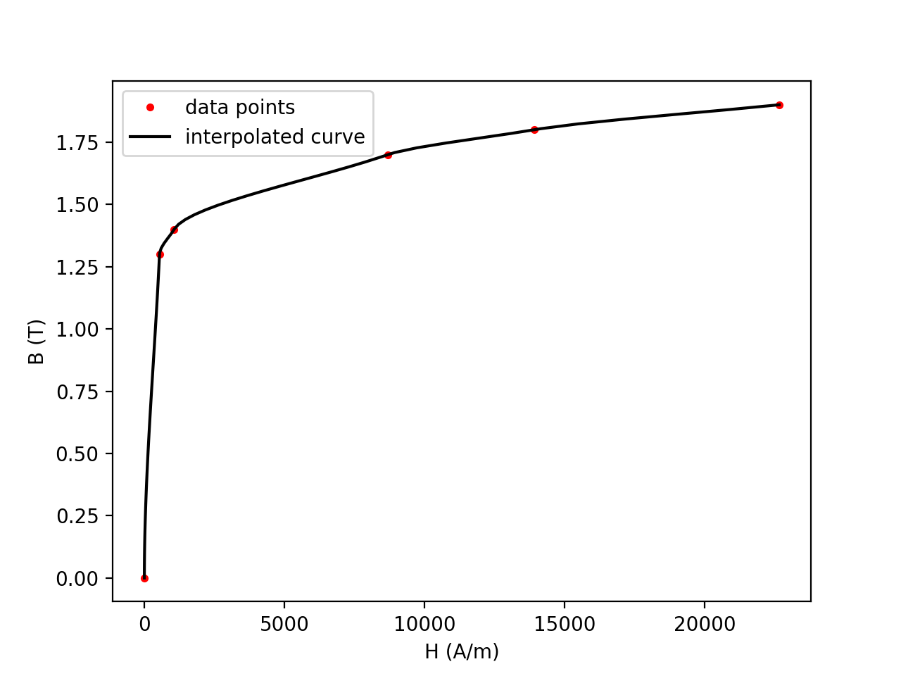

---
header-includes:
  - \usepackage{listings}
cref: true
---

\lstset{basicstyle=\small}
\crefformat{equation}{(#2#1#3)}
\crefformat{figure}{Figure~#2#1#3}
\crefformat{table}{Table~#2#1#3}

# ECSE 543 Numerical Methods - Assignment 3

Anass Al-Wohoush, 260575013

## Question 1

### a
{#fig:interp-a width=75%}

@fig:interp-a seems like a plausible B-H curve over the given range. 

### b
{#fig:interp-b width=75%}

@fig:interp-b does not seem like a plausible B-H curve over the given range. 

### c
{#fig:interp-c width=75%}

@fig:interp-c is the generated interpolation plot by setting the slopes to:

$$
\frac{y_1 - y_0}{x_1 - x_0}.
$$

## Question 2

### a
We have:

$$
\begin{aligned}
\mathcal{R}_{a} &= \frac{L_a}{A \mu_0} = \frac{0.005}{0.0001 \times 4\pi \times 10^{-7}} = 3.9789 \times 10^7 \text{H}^{-1} \\
\mathcal{R}_{c} &= \frac{L_c}{A \mu}.
\end{aligned}
$$

$\mu$ is non-linear and can be measured from the B-H curve in Question 1 as:

$$
\begin{aligned}
\mu &= \frac{B}{H}, \\
B &= \frac{\Psi}{A}.
\end{aligned}
$$

Subsituting back, yields:

$$
\mathcal{R}_{c} = \frac{L_c H}{\Psi},
$$

where $H$ is a function of $\Psi$. The flux $\Psi$ in the core can then be expressed as follows:

$$
\begin{aligned}
f(\Psi) &= (\mathcal{R}_{a} + \mathcal{R}_{c}) \Psi - I N = 0 \\
f(\Psi) &= 3.9789 \times 10^7 \Psi + 0.30 H(\Psi) - 8000 = 0.
\end{aligned}
$$

### b

Newton-Raphson was able to solve the equation above in 3 iterations and yielded
$1.612 \times 10^-4$ Wb.

```
Newton-Raphson method
iteration: 1, x = 1.999525E-04, f(x) = +9.356309E+03
iteration: 2, x = 1.689268E-04, f(x) = +1.201902E+03
iteration: 3, x = 1.612691E-04, f(x) = +2.728484E-12
Magnetic flux = 1.612691E-04 Wb
```

### c

Successive substitution did not originally converge, but modifying the
iteration step to:

$$
x_{i+1} = x_i - c f(x_i)
$$

converged after 9 iterations to the same solution as in **b** with
$c = 6.5 \times 10^{-9}$. $c$ was determined by trial and error until it
converged.

```
Successive substitution method
iteration: 1, x = 5.200000E-05, f(x) = -5.913686E+03
iteration: 2, x = 9.043896E-05, f(x) = -4.353204E+03
iteration: 3, x = 1.187348E-04, f(x) = -3.174563E+03
iteration: 4, x = 1.393694E-04, f(x) = -2.145668E+03
iteration: 5, x = 1.533163E-04, f(x) = -9.591690E+02
iteration: 6, x = 1.595509E-04, f(x) = -2.502577E+02
iteration: 7, x = 1.611776E-04, f(x) = -1.436812E+01
iteration: 8, x = 1.612709E-04, f(x) = +2.902504E-01
iteration: 9, x = 1.612691E-04, f(x) = -5.863349E-03
Magnetic flux = 1.612691E-04 Wb
```

\newpage
## Appendix

### `bh_curve.py`

\lstinputlisting[language=Python]{bh_curve.py}

\newpage
### `interpolation.py`

\lstinputlisting[language=Python]{interpolation.py}

\newpage
### `non_linear.py`

\lstinputlisting[language=Python]{non_linear.py}

\newpage
### `matrix.py`

\lstinputlisting[language=Python]{matrix.py}
